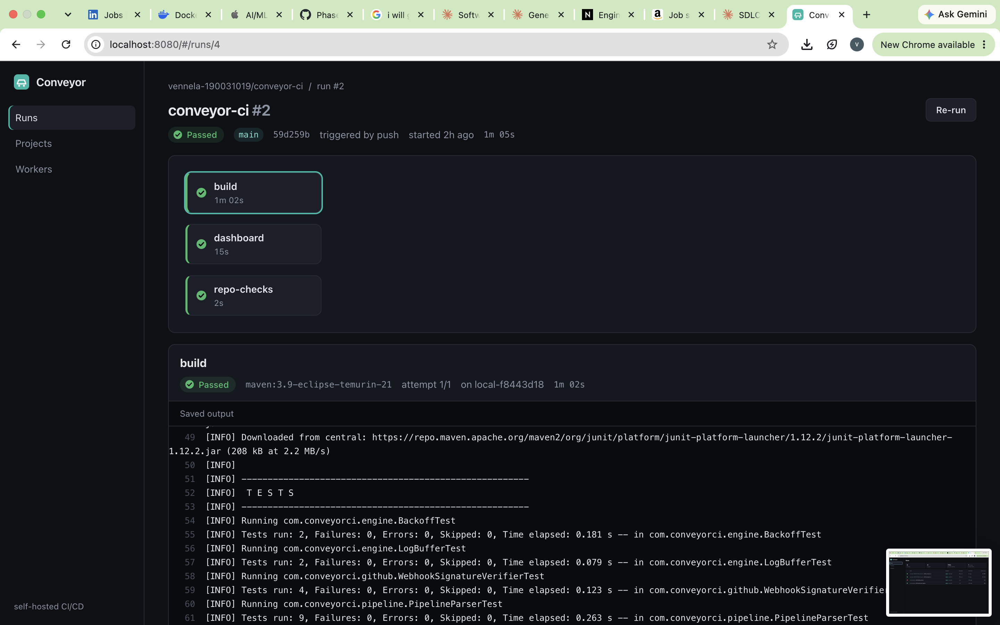
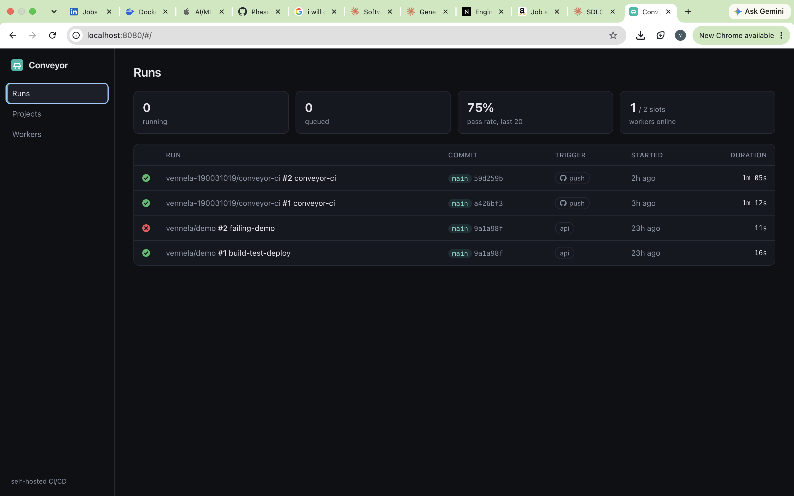

# Conveyor CI

A self-hosted CI/CD platform: pipelines defined in YAML, jobs scheduled as a dependency DAG,
executed in Docker containers by a pool of workers that recovers automatically from crashes.

> **Status: Phase 4 of 6 complete.** Push to a connected GitHub repo and Conveyor checks out
> the commit, runs its `.conveyor.yml` across a pool of workers, streams the logs live to a
> React dashboard, and reports ✓/✗ on the commit. This repository builds itself on Conveyor
> (see [`.conveyor.yml`](.conveyor.yml)).
> Next up: load testing with published throughput and latency numbers.





## Architecture

```
 GitHub push ──webhook (HMAC-signed)──┐                 ┌──► commit status ✓/✗ (outbox, retried)
                                      ▼                 │
            ┌──────────────── API node ─────────────────┐
 HTTP ────► │ Controllers ─► Services ─► Postgres (JPA)  │
            │                                            │
            │ Scheduler (every 1s, advisory-locked)      │
            │   skip ─► promote ─► reap leases ─► finalize│
            │   └─► dispatch ready job ids ──────────────┼──► Redis list ──┐
            └────────────────────────────────────────────┘                 │ BRPOP
                                                                           ▼
            ┌──────────────── Worker node (N of them) ───────────────────────┐
            │ claim job in Postgres (atomic UPDATE)                          │
            │ docker run ─► checkout commit (tarball) ─► docker exec steps   │
            │ heartbeat every lease/3 ─► extends lease; lost lease = kill    │
            └────────────────────────────────────────────────────────────────┘
```

**Postgres is the source of truth. Redis is only a dispatch channel.** A worker must win an
atomic `UPDATE ... WHERE status = 'QUEUED'` before running anything, so duplicate or lost
queue messages can never corrupt state. Lost messages are re-dispatched after 30 seconds.

### Job lifecycle

```
PENDING ──deps succeeded──► QUEUED ──claimed──► RUNNING ──► SUCCEEDED
   │                          ▲                   │
   │                          └── retry (backoff) ┤  attempts left
   │                          └── lease expired ──┤
   │                                              └──► FAILED  (out of attempts)
   └──a dependency failed──► SKIPPED          any unfinished job ──cancel──► CANCELLED
```

## How it handles failure

| Scenario | What happens |
|---|---|
| Step exits non-zero | Job retried up to `retries` times with exponential backoff and ±20% jitter; then FAILED |
| Dependency fails | Every downstream job is SKIPPED, cascading through the whole DAG |
| **Worker crashes** (`kill -9`, OOM, host dies) | Heartbeats stop, the lease expires (30s), and the scheduler re-queues the job for another worker |
| **Zombie worker** (was partitioned, comes back) | All its writes are *fenced*: conditioned on `(worker_id, attempt, status)`, so they're rejected and can't overwrite the new owner's result |
| Run cancelled | Unfinished jobs → CANCELLED; the running worker sees it at its next heartbeat and kills the container |
| Job exceeds `timeout_minutes` | Container killed, attempt fails (and may retry) |
| Redis message lost or duplicated | Re-dispatched after 30s / duplicate claim is rejected by Postgres |
| Two schedulers running | A transaction-scoped Postgres advisory lock allows one pass at a time |
| Clock skew between machines | Leases use the database clock (`now()`), never the worker's |

## Features by phase

**Phase 4: dashboard and live logs**
- React + TypeScript dashboard (Vite, no UI framework): recent runs with pass rate and worker
  capacity, a run page with the pipeline **DAG** (edges light up as dependencies pass), per-job
  logs, **cancel** and **re-run**, projects, and worker health
- **Live logs over Server-Sent Events.** Workers batch output lines every 200 ms into a capped
  Redis list (for late joiners) plus one pub/sub message (for current viewers). Every API node
  subscribes, so a browser can connect to any node
- **Gap-free, duplicate-free joining mid-run.** A viewer is registered before the snapshot is
  read; live events queue until the snapshot is sent, then are merged by per-attempt sequence
  number. A retry sends a `reset`, and stragglers from an old attempt are dropped
- Workers flush logs *before* recording a job's final status, so "finished" never shows up with
  output still missing; live logs are best-effort, and Postgres keeps the full per-step output

**Phase 3: GitHub integration**
- `POST /api/webhooks/github` receives push events. Requests are verified with HMAC-SHA256
  (`X-Hub-Signature-256`, constant-time compare) and it fails closed if no secret is set
- Idempotent: GitHub's delivery id is recorded, so redeliveries never start a second run
- Reads `.conveyor.yml` from the pushed commit; tag pushes, branch deletions, unregistered
  repos and commits without a pipeline file are ignored (and recorded)
- An invalid `.conveyor.yml` becomes a FAILED run with the validation errors, reported on the
  commit, instead of silently doing nothing
- Workers check out the exact commit: GitHub tarball → extract → `docker cp` into
  `/workspace`. It works with any image, since it doesn't need git inside the container
- Commit statuses via an **outbox**: each run stores the last state it reported; a reporter
  sends pending → success/failure/error and retries with backoff if GitHub is down. HTTP calls
  happen outside database transactions (rows are leased, like jobs)

**Phase 2: execution engine**
- Scheduler: promotes, skips, reaps and finalizes in one transaction, then pushes to Redis
  *after commit*, so a worker can never pop a job that isn't yet visible as QUEUED
- Workers: configurable concurrency; one container per job attempt with memory/CPU limits;
  steps share `/workspace`; per-step logs (last 64 KB) and exit codes
- Leases and heartbeats, fencing tokens, retries with backoff, cancellation, job timeouts
- Worker registry with liveness (`GET /api/workers`)
- Runs in one process for development, or as separate API and worker nodes

**Phase 1: API and pipeline model**
- YAML parser that reports *every* error in one pass, including cycles with the full path
  (`a -> b -> c -> a`); safe loading (no arbitrary types, size and alias limits)
- Stage computation (longest dependency chain) for parallelism
- Per-project run numbers allocated under a row lock (`SELECT ... FOR UPDATE`)
- Flyway-managed schema; integration tests against real Postgres and Redis (Testcontainers)

## Pipeline format

```yaml
name: build-test-deploy
jobs:
  build:
    image: alpine:3.20
    steps:
      - name: Compile
        run: mkdir -p out && echo ok > out/app.txt
  unit-tests:
    image: python:3.12-alpine
    needs: build            # a job name or a list of job names
    retries: 1              # 0-5, default 0
    timeout_minutes: 5      # 1-360, default 30
    steps:
      - run: python -c "print('tests passed')"
```

More in [`examples/`](examples).

## Run locally

Requirements: Java 21, Maven 3.9+, Docker.

```bash
docker compose up -d        # Postgres on :54329, Redis on :63790
mvn spring-boot:run         # API + scheduler + a worker, on http://localhost:8080
mvn verify                  # unit + integration tests (needs Docker running)
```

### Try it

```bash
curl -s -X POST localhost:8080/api/projects -H 'Content-Type: application/json' \
  -d '{"owner":"vennela","name":"demo"}'

scripts/trigger.sh 1 examples/pipeline.yml      # prints the run id
scripts/watch.sh <run-id>                       # live job status
curl -s localhost:8080/api/jobs/<job-id>/logs   # step output
```

### Dashboard

```bash
cd ui && npm install && npm run build   # builds into the API's static files
open http://localhost:8080              # served by Conveyor itself (also via your ngrok URL)
```

For UI development with hot reload, run `npm run dev` in `ui/` and open http://localhost:5173
(API calls are proxied to :8080).

### Connect a GitHub repository

Conveyor needs a public URL for GitHub to reach it. [ngrok](https://ngrok.com) works well
because it forwards the request body byte-for-byte, which signature verification requires.

```bash
# 1. Expose the API
ngrok http 8080                                   # note the https://….ngrok-free.app URL

# 2. Start Conveyor with GitHub credentials (a classic token with `repo` scope)
export GITHUB_TOKEN=ghp_...
export GITHUB_WEBHOOK_SECRET=$(openssl rand -hex 20); echo $GITHUB_WEBHOOK_SECRET
export CONVEYOR_PUBLIC_URL=https://<your-ngrok-url>
mvn spring-boot:run

# 3. Register the repository (owner and name as on GitHub)
curl -s -X POST localhost:8080/api/projects -H 'Content-Type: application/json' \
  -d '{"owner":"<github-user>","name":"<repo>"}'
```

4. On GitHub: **repo → Settings → Webhooks → Add webhook**
   - Payload URL: `https://<your-ngrok-url>/api/webhooks/github`
   - Content type: `application/json`
   - Secret: the value of `GITHUB_WEBHOOK_SECRET`
   - Events: *Just the push event*
5. Add a `.conveyor.yml` to the repository and push. The run starts within a second, and the
   commit shows a yellow dot, then ✓ or ✗.

### Demo: crash recovery

Run the API without its built-in worker, plus two separate workers:

```bash
mvn -q -DskipTests package
mvn spring-boot:run -Dspring-boot.run.arguments=--conveyor.worker.enabled=false   # terminal 1
scripts/worker.sh worker-a                                                        # terminal 2
scripts/worker.sh worker-b                                                        # terminal 3

scripts/trigger.sh 1 examples/slow-pipeline.yml                                   # terminal 4
scripts/watch.sh <run-id>
```

Once both jobs are running, kill one worker hard, which it can't clean up after:

```bash
kill -9 $(pgrep -f 'conveyor.worker.id=worker-a')
```

About 30 seconds later its job flips back to QUEUED ("worker lease expired") and `worker-b`
picks it up as attempt 2.

## API

| Method | Path | Description |
|---|---|---|
| POST | `/api/projects` | Create a project `{owner, name, defaultBranch?}` |
| GET | `/api/projects` | List projects |
| GET | `/api/projects/{id}` | Get a project |
| POST | `/api/projects/{id}/runs` | Trigger a run `{commitSha, branch, pipelineYaml}` |
| GET | `/api/projects/{id}/runs` | Latest 50 runs, newest first |
| GET | `/api/runs` | Latest 50 runs across all projects |
| GET | `/api/runs/{id}` | Run with stages, jobs (status, attempt, worker, failure reason) and steps |
| POST | `/api/runs/{id}/rerun` | Start a new run from the same pipeline snapshot and commit |
| POST | `/api/runs/{id}/cancel` | Cancel a queued or running run |
| GET | `/api/jobs/{id}/logs` | Plain-text output of every step |
| GET | `/api/jobs/{id}/logs/stream` | Live output as Server-Sent Events (`lines`, `reset`, `end`) |
| GET | `/api/workers` | Registered workers and liveness |
| POST | `/api/pipelines/validate` | Dry-run validation (body: raw YAML) |
| POST | `/api/webhooks/github` | GitHub webhook receiver (push, ping) |

`POST /api/projects/{id}/runs` also accepts `"checkout": true` to run against the project's
GitHub repository at `commitSha`.

Errors use RFC 9457 `application/problem+json`: `400` for bad requests, `404` for missing
resources, `409` for conflicts, and `422` for an invalid pipeline, with an `errors` array.

## Configuration

| Property | Default | Meaning |
|---|---|---|
| `conveyor.scheduler.enabled` | `true` | Run the scheduler in this process |
| `conveyor.scheduler.interval-ms` | `1000` | Scheduler pass interval |
| `conveyor.worker.enabled` | `true` | Run a worker in this process |
| `conveyor.worker.concurrency` | `2` | Jobs this worker runs at once |
| `conveyor.worker.lease-seconds` | `30` | Time until a silent worker's job is re-queued |
| `conveyor.retry.base-delay-ms` / `max-delay-ms` | `2000` / `60000` | Retry backoff |
| `conveyor.docker.memory` / `cpus` | `1g` / `1` | Per-job container limits |
| `conveyor.github.token` (`GITHUB_TOKEN`) | empty | Needed for commit statuses and private repos |
| `conveyor.github.webhook-secret` (`GITHUB_WEBHOOK_SECRET`) | empty | Webhooks are rejected until set |
| `conveyor.github.pipeline-path` | `.conveyor.yml` | Pipeline file read from each commit |
| `conveyor.public-url` (`CONVEYOR_PUBLIC_URL`) | `http://localhost:8080` | Base URL for "Details" links on GitHub |

## Design decisions

- **Postgres as the single source of truth.** One place to reason about correctness; Redis
  can be flushed at any time without losing a job.
- **Leases and fencing instead of distributed locks.** A worker's ownership is time-bounded
  and every write re-checks it, which covers crashes, pauses and network partitions.
- **Push to Redis after commit.** Avoids a worker popping an id whose row isn't visible yet.
- **At-least-once execution.** A crashed job may run twice, so steps should be idempotent,
  the same contract as GitHub Actions and most CI systems.
- **Server-Sent Events over WebSockets for logs.** The flow is one-way; SSE is plain HTTP, so
  it passes through proxies like ngrok, and browsers reconnect on their own.
- **Snapshot + live, merged by sequence number.** Subscribing before reading the snapshot
  closes the race where lines printed in between would be lost.
- **Outbox for commit statuses.** Reporting to GitHub is a side effect that can fail;
  deriving "what should GitHub show" from run state and retrying until it matches is simpler
  and more reliable than calling GitHub inline from the scheduler.
- **Tarball checkout on the worker, not `git clone` in the job.** Works with images that don't
  have git, and downloads one commit instead of the full history.
- **Docker CLI over a Docker SDK.** Zero extra dependencies; works with Docker Desktop,
  Colima or a remote `DOCKER_HOST`.
- **Collect all validation errors, strict unknown-key rejection, parse before locking.**
  (Phase 1.)

**Known limitations:** the API has no authentication yet, so anyone who can reach it (e.g. via a
public ngrok URL) can cancel or re-run builds; GitHub OAuth login comes with the deployment in
Phase 5. Also, a worker killed with `kill -9` leaves its job container running
(label `conveyor.managed=true`); a janitor is planned. Jobs don't share files yet; artifacts
come in a later phase.

## Roadmap

1. ~~Core API, data model, YAML to DAG parser~~
2. ~~Redis job queue, Docker workers, heartbeats and lease-based recovery, retries with backoff~~
3. ~~GitHub webhooks (HMAC-verified), repo checkout, commit statuses~~
4. ~~Live log streaming (Redis pub/sub → Server-Sent Events) and a React dashboard~~
5. AWS deployment with GitHub OAuth login; the platform runs its own CI
6. Load testing and published numbers (throughput, queue latency, recovery time)
